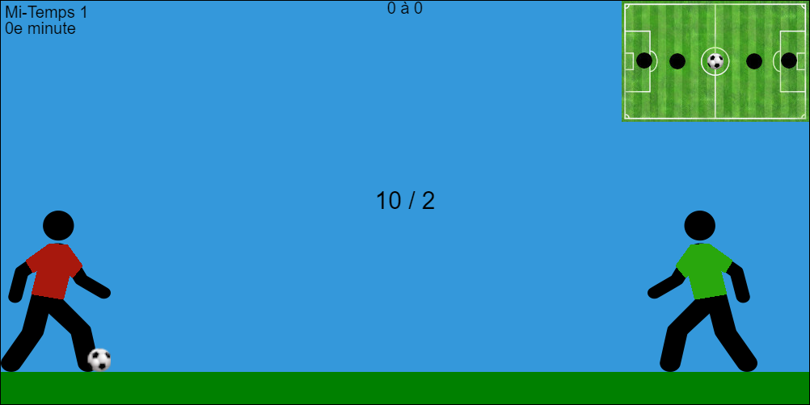

# FootMath : Un jeu éducatif en ligne.

## Qu'est-ce que FootMath ?
FootMath est un jeu éducatif de mathématiques pour enfants en primaire, réalisé en JavaScript pour un projet scolaire. Le jeu est un match de football, où chaque action se décide grace à une question de calcul mental. Le jeu a plusieurs niveaux de difficulté, et permet de participer à des exercices sur plusieurs types d'équations. Il y a également un système de compte, avec des trophées et scores sauvegardés.

## Liens
- Pour jouer : **[FootMath](https://pseudo-nyme.github.io/jour-d-ecole/)**
- Code Source : [Github FootMath](https://github.com/Pseudo-Nyme/jour-d-ecole)
- Documentation : [Doc](https://github.com/Pseudo-Nyme/jour-d-ecole/blob/master/DOC.md)

## Licence
Le code est sous licence libre  [GNU GPL v3](https://www.gnu.org/licenses/licenses.fr.html)
En l'état du projet, toutes les ressources multimédia ne sont pas libres, ce qui peut rendre problématique sa distribution.